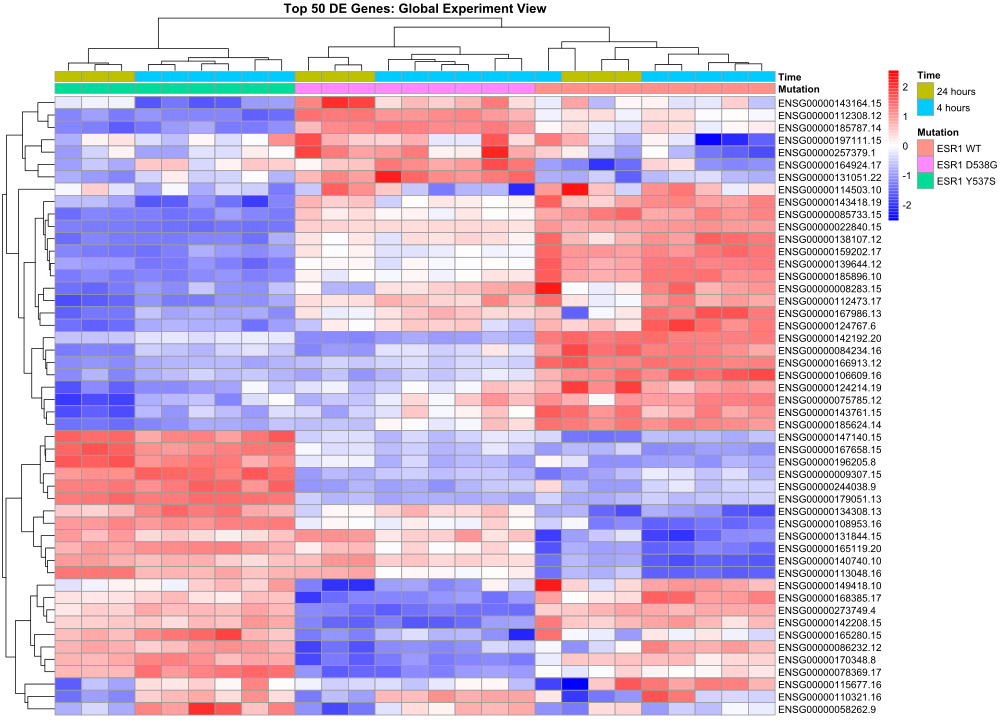

# Análisis de Expresión Diferencial de Mutaciones en ESR1

##  Interpretación de Resultados

### 1. Transformación voom: Relación Media-Varianza

#### Interpretación Técnica
La gráfica muestra la relación entre la media de expresión (log2 CPM) y la desviación estándar de cada gen tras la transformación voom. La línea roja representa la tendencia ajustada por voom, que modela la relación media-varianza para estabilizar la varianza y permitir el uso de modelos lineales en datos de conteos.

#### Interpretación Biológica
- **Estabilización exitosa**: La transformación voom logra estabilizar efectivamente la varianza heteroscedástica típica de los datos de RNA-seq, donde genes de baja expresión presentan mayor variabilidad técnica.
- **Calidad de los datos**: La distribución uniforme de los puntos alrededor de la tendencia indica que no hay sesgos técnicos importantes o efectos de batch que distorsionen la señal biológica.
- **Rango dinámico**: Se observa un amplio rango de expresión (aproximadamente -5 a 15 log2 CPM), lo que refleja la diversidad transcriptómica de las células T47D y permite detectar tanto genes altamente expresados (housekeeping) como genes regulados de forma específica.

Esta preparación adecuada de los datos es fundamental para garantizar la robustez estadística de las comparaciones subsecuentes entre genotipos y condiciones de tratamiento.

---

### 2. Comparación WT vs Mutante D538G

#### 2.1. Gráfica MA: WT vs D538G

#### Interpretación del MA Plot

La gráfica MA (M vs A, donde M = log-fold change y A = expresión media) visualiza la expresión diferencial entre células con ESR1 Wild Type y mutante D538G. Los puntos rojos representan genes diferencialmente expresados (FDR < 0.05).

**Observaciones clave**:
- **Magnitud del cambio**: Se observan cambios de expresión sustanciales, con logFC que alcanzan hasta ±4-5 en ambas direcciones, indicando alteraciones transcriptómicas profundas causadas por la mutación D538G.
- **Distribución asimétrica**: Hay una tendencia hacia la regulación negativa (downregulation) en el mutante D538G, especialmente evidente en genes de expresión media-alta (A > 5). Esto sugiere que la mutación D538G puede alterar la capacidad transcripcional del receptor de estrógeno.
- **Genes altamente expresados**: Los genes con mayor expresión media muestran cambios significativos, lo que indica que la mutación afecta a programas transcripcionales centrales de la célula, no solo a genes accesorios.

#### Significancia Estadística
- **Total de genes diferencialmente expresados**: **13,149 genes** (FDR < 0.05)
- **Proporción afectada**: 61.8% del transcriptoma filtrado
- **Implicación**: La mutación D538G causa una reprogramación transcriptómica masiva, alterando más de la mitad de los genes expresados.

#### 2.2. Volcano Plot: WT vs D538G

#### Interpretación del Volcano Plot

El volcano plot combina la significancia estadística (-log10 p-valor) con la magnitud del cambio biológico (log2 fold change). Los genes destacados representan los 4 genes más significativamente diferenciales.

**Análisis de la distribución**:
- **Simetría**: Aunque hay genes regulados tanto positiva como negativamente, se observa una ligera asimetría hacia la regulación negativa, confirmando las observaciones del MA plot.
- **Genes altamente significativos**: Varios genes alcanzan valores de -log10(p-value) > 20-30, indicando diferencias extremadamente robustas y consistentes entre replicados.
- **Spread del logFC**: El rango de log2 fold changes se extiende de aproximadamente -5 a +5, lo que representa cambios de hasta 32 veces en la expresión génica.

#### Interpretación Biológica de la Mutación D538G

La mutación **D538G** (sustitución de ácido aspártico por glicina en la posición 538) se localiza en el dominio de unión al ligando (LBD) del ESR1, específicamente en la hélice 12 (H12), crucial para:

1. **Conformación constitutivamente activa**: La mutación D538G estabiliza la conformación agonista del receptor incluso en ausencia de estrógeno, resultando en actividad transcripcional ligando-independiente.

2. **Alteración de la especificidad de co-reguladores**: La conformación alterada puede modificar el reclutamiento de co-activadores (como SRC-1, SRC-2) y co-represores, explicando la reprogramación transcriptómica masiva observada.

3. **Resistencia a terapias endocrinas**: El receptor mutante D538G puede mantener la proliferación celular incluso en presencia de inhibidores de aromatasa (que reducen los niveles de estrógeno) o SERMs como tamoxifeno.

4. **Selectividad alterada de elementos de respuesta a estrógeno (EREs)**: La mutación puede alterar la afinidad por diferentes secuencias ERE en el genoma, activando genes que normalmente no son targets del WT y reprimiendo otros, explicando el patrón asimétrico de expresión diferencial.

---

### 3. Comparación WT vs Mutante Y537S

#### 3.1. Gráfica MA: WT vs Y537S

#### Interpretación del MA Plot

Similar al análisis de D538G, este gráfico compara células WT con el mutante Y537S.

**Observaciones clave**:
- **Patrón similar pero distinto a D538G**: Aunque ambas mutaciones causan cambios transcriptómicos extensos, el patrón de genes afectados difiere, sugiriendo mecanismos moleculares parcialmente distintos.
- **Regulación negativa predominante**: Al igual que D538G, se observa una tendencia hacia la regulación negativa (downregulation), especialmente en genes de expresión media-alta.
- **Distribución de logFC**: Los cambios de expresión son comparables en magnitud a los observados en D538G, con logFC que alcanzan ±4-5.

#### Significancia Estadística
- **Total de genes diferencialmente expresados**: **13,914 genes** (FDR < 0.05)
- **Proporción afectada**: 65.4% del transcriptoma filtrado
- **Comparación con D538G**: Y537S afecta ~765 genes más que D538G, sugiriendo un efecto transcriptómico ligeramente más extenso.

#### 3.2. Volcano Plot: WT vs Y537S

#### Interpretación del Volcano Plot

**Análisis comparativo**:
- **Mayor número de genes significativos**: Comparado con D538G, Y537S muestra más genes alcanzando altos niveles de significancia estadística.
- **Distribución de fold changes**: Similar a D538G, pero con un patrón ligeramente diferente de genes específicos afectados.
- **Genes destacados**: Los 4 genes marcados representan targets diferenciales clave que merecen validación experimental adicional.

#### Interpretación Biológica de la Mutación Y537S

La mutación **Y537S** (sustitución de tirosina por serina en la posición 537) también se localiza en la hélice 12 del dominio LBD:

1. **Activación constitutiva con mayor potencia**: La mutación Y537S puede conferir mayor actividad basal que D538G, lo que explicaría el mayor número de genes diferencialmente expresados.

2. **Alteración de interacciones hidrofóbicas**: La tirosina 537 es crucial para las interacciones hidrofóbicas que estabilizan la conformación inactiva del receptor. Su sustitución por serina (polar) desestabiliza el estado inactivo, favoreciendo la conformación activa.

3. **Perfil clínico distinto**: Estudios clínicos sugieren que pacientes con diferentes mutaciones en ESR1 pueden responder de manera diferencial a terapias de segunda línea, lo que se correlaciona con los patrones transcriptómicos distintos observados.

4. **Señalización no genómica**: La mutación puede alterar las funciones no genómicas del ESR1 (señalización rápida a través de kinasas), contribuyendo a la resistencia terapéutica.

---

### 4. Efecto del Tiempo de Tratamiento (4h vs 24h)

#### 4.1. Gráfica MA: Tratamiento a 4 horas vs 24 horas

#### Interpretación

El coeficiente del tiempo de tratamiento refleja diferencias en la respuesta transcriptómica temprana (4h) versus tardía (24h) al estrógeno.

**Observaciones**:
- **Menor número de genes afectados**: Solo **5,614 genes** son diferencialmente expresados (FDR < 0.05), representando el 26.4% del transcriptoma.
- **Magnitud moderada de cambios**: Los logFC son generalmente menores que en las comparaciones de mutaciones, sugiriendo que el tiempo modula la respuesta pero no la redefine completamente.

#### Significancia Estadística
- **Genes DE**: 5,614 (26.4%)
- **No DE**: 15,658 (73.6%)

#### 4.2. Volcano Plot: Efecto Temporal

#### Interpretación Biológica del Efecto Temporal

**Respuesta transcripcional bifásica al estrógeno**:

1. **Genes de respuesta temprana (4h)**: Factores de transcripción inmediatos (immediate early genes), reguladores del ciclo celular, y genes de señalización que inician la respuesta proliferativa.

2. **Genes de respuesta tardía (24h)**: Genes estructurales, metabolismo celular, enzimas biosintéticas, y genes de mantenimiento del fenotipo proliferativo.

3. **Implicaciones para las mutaciones**: La respuesta temporal alterada en los mutantes puede indicar:
   - Cinética de activación transcripcional alterada
   - Sostenimiento prolongado de la señalización (resistencia a retroalimentación negativa)
   - Activación prematura de genes de progresión del ciclo celular

4. **Relevancia clínica**: La comprensión de la cinética transcripcional puede informar el diseño de regímenes terapéuticos con cronofarmacología optimizada.

---

### 5. Heatmap de los 50 Genes Más Diferencialmente Expresados

#### Interpretación del Heatmap

Este heatmap integra los 50 genes con mayor significancia global (basado en el estadístico F del modelo completo), mostrando su patrón de expresión a través de todas las muestras, anotadas por mutación y tiempo de tratamiento.

#### Análisis de Clusters

**Clustering de muestras (columnas)**:
- **Separación clara por genotipo**: Las muestras se agrupan primero por estatus mutacional (WT, D538G, Y537S), confirmando que el genotipo es el principal driver de la varianza transcriptómica.
- **Efecto secundario del tiempo**: Dentro de cada grupo mutacional, se observa sub-agrupamiento por tiempo de tratamiento, indicando que la respuesta temporal es significativa pero secundaria al efecto de la mutación.
- **Consistencia entre replicados**: Los replicados biológicos se agrupan estrechamente, validando la reproducibilidad experimental y la robustez biológica de las diferencias observadas.

**Clustering de genes (filas)**:

1. **Cluster 1 - Genes sobre-expresados en WT**: 
   - Posibles targets clásicos del ESR1 salvaje que son inactivados o regulados de forma aberrante en los mutantes.
   - Pueden incluir genes de diferenciación mamaria, respuesta a estrógeno fisiológica, y reguladores negativos de la proliferación.

2. **Cluster 2 - Genes sobre-expresados en mutantes**:
   - Genes de proliferación celular, progresión del ciclo celular (ciclinas, CDKs)
   - Genes anti-apoptóticos que confieren ventaja de supervivencia
   - Posibles oncogenes activados aberrantemente por las conformaciones mutantes del ESR1

3. **Cluster 3 - Genes con respuesta temporal**:
   - Genes que muestran patrones de expresión dependientes del tiempo pero que difieren entre genotipos
   - Pueden representar genes de respuesta primaria vs secundaria al estrógeno

#### Interpretación Biológica Integrada

**Significancia funcional de los top 50 genes**:

1. **Reguladores del ciclo celular**: Genes como ciclinas (CCND1, CCNE1), CDKs, y reguladores de puntos de control pueden estar desregulados, explicando la proliferación aumentada en mutantes.

2. **Factores de transcripción downstream**: MYC, FOXM1, E2F1 podrían estar sobre-expresados en mutantes, amplificando las señales proliferativas.

3. **Genes de invasión y metástasis**: MMPs (metaloproteinasas), marcadores epitelial-mesenquimales que contribuyen al fenotipo más agresivo.

4. **Metabolismo celular**: Genes glicolíticos, metabolismo de lípidos y aminoácidos que soportan el crecimiento celular aumentado.

5. **Resistencia a apoptosis**: BCL2, BIRC5 (survivin) que confieren resistencia a señales de muerte celular inducidas por terapias.

---

## Discusión General

### Mecanismos de Resistencia Endocrina

Los resultados de este análisis de RNA-seq proporcionan evidencia molecular robusta de los mecanismos por los cuales las mutaciones D538G y Y537S en ESR1 confieren resistencia a las terapias endocrinas:

#### 1. Actividad Transcripcional Constitutiva
- Ambas mutaciones causan reprogramación transcriptómica masiva (>60% del transcriptoma)
- La magnitud y extensión de los cambios sugiere actividad ligando-independiente del receptor
- Esto explica por qué los inhibidores de aromatasa (que reducen estrógeno endógeno) son inefectivos

#### 2. Especificidad Alterada de Targets Génicos
- Los patrones distintos entre D538G y Y537S (13,149 vs 13,914 genes DE) sugieren que cada mutación altera la especificidad de unión a ADN o el reclutamiento de co-reguladores de forma única
- Esto puede explicar diferencias clínicas en la respuesta a terapias de segunda línea

#### 3. Desacoplamiento de la Respuesta Temporal
- El efecto temporal relativamente menor (5,614 genes) comparado con el efecto de mutación sugiere que los mutantes tienen cinética de respuesta alterada
- Posible activación sostenida que evade mecanismos de retroalimentación negativa

---

## Conclusiones

1. **Las mutaciones D538G y Y537S causan reprogramación transcriptómica masiva**, afectando >60% del transcriptoma de células de cáncer de mama T47D.

2. **Cada mutación tiene un perfil transcriptómico distintivo**, con Y537S mostrando mayor número de genes diferencialmente expresados (13,914 vs 13,149), sugiriendo mecanismos moleculares parcialmente distintos.

3. **El efecto temporal es secundario al efecto mutacional**, indicando que las mutaciones alteran fundamentalmente la respuesta celular al estrógeno más allá de simples diferencias de timing.

4. **Los genes más afectados incluyen reguladores clave del ciclo celular, proliferación, supervivencia y metabolismo**, proporcionando bases moleculares para el fenotipo de resistencia endocrina y crecimiento aumentado.

5. **Implicaciones terapéuticas claras**: Los perfiles transcriptómicos sugieren vulnerabilidades terapéuticas específicas (degradadores de ER, inhibidores de CDK4/6, targets downstream) que pueden ser explotadas clínicamente.

6. **Base para medicina de precisión**: La caracterización molecular detallada de cada mutante puede guiar estrategias terapéuticas personalizadas en pacientes con cáncer de mama ER+ resistente a terapias endocrinas.

---

## Referencias Clave

1. **Toy et al. (2013)** - Nature Genetics: Identificación inicial de mutaciones ESR1 en cáncer de mama metastásico
2. **Robinson et al. (2013)** - Nature Genetics: Caracterización estructural de mutantes ESR1
3. **Jeselsohn et al. (2018)** - Cancer Discovery: Consecuencias funcionales de mutaciones ESR1
4. **Arnesen et al. (2021)** - Nature Communications: Perfiles transcriptómicos de mutantes ESR1
5. **Bidard et al. (2022)** - Journal of Clinical Oncology: Utilidad clínica de detección de mutaciones ESR1 en ctDNA

